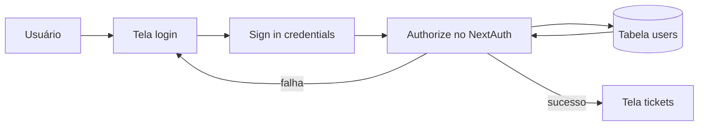
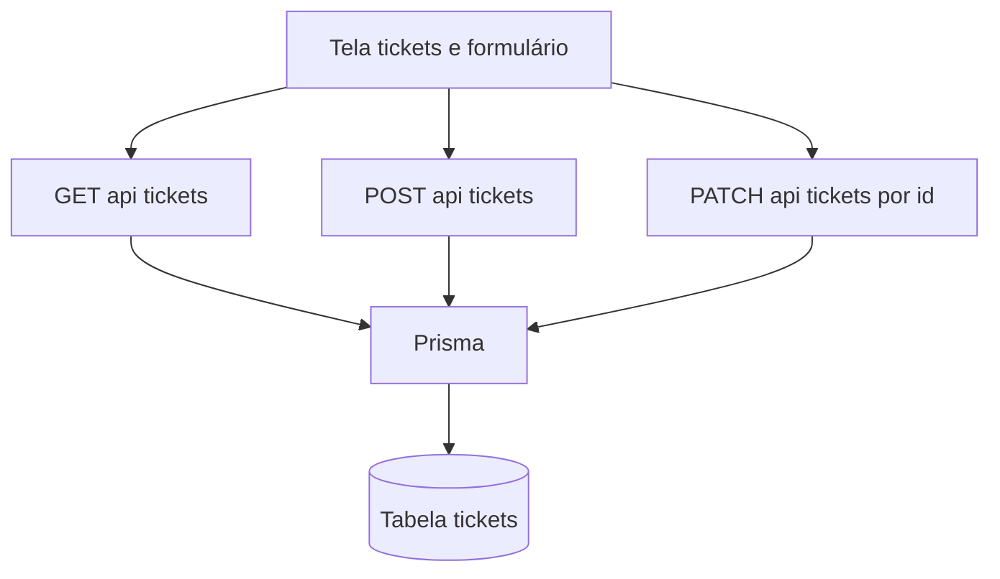
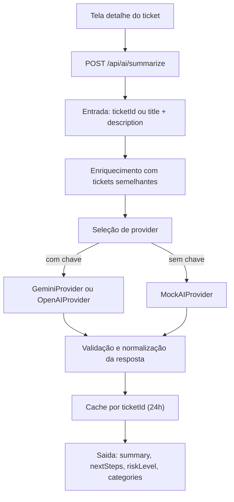

# Ops Copilot - Teste Tecnico Full-Stack

## Visao geral do produto
Ops Copilot e um mini sistema para operações internas, com foco em registro de incidentes e tarefas via tickets, incluindo suporte de IA para resumo e próximos passos.

Funcionalidades implementadas:
- criação de tickets
- listagem de tickets
- busca por título e descrição
- filtros por status, prioridade e tags
- paginação
- tela de detalhe do ticket
- edição de ticket
- autenticação com rotas protegidas
- resumo com IA (real ou mock fallback)

### Credenciais de teste
- Email: `admin@opscopilot.com`
- Senha: `123456`

### Rotas principais da aplicação
- `/login`
- `/tickets`
- `/tickets/new`
- `/tickets/[id]`
- `/tickets/[id]/edit`

### URL do sistema em produção
- `https://ops-copilot-git-master-julio-paulos-projects.vercel.app/`

## Stack tecnica
| Camada | Tecnologia | Versão |
|---|---|---|
| Framework | Next.js (App Router) | `16.1.6` |
| UI | React | `19.2.3` |
| Linguagem | TypeScript | `^5` (strict = true) |
| Estilo | Tailwind CSS | `^4` |
| Componentes | shadcn/ui | CLI `^4.0.6` |
| Auth | NextAuth (Credentials) | `^5.0.0-beta.30` |
| ORM | Prisma | `6.19.2` |
| Banco | PostgreSQL | `postgres:15` |
| Validacao | Zod | `^4.3.6` |
| Formulario | React Hook Form | `^7.71.2` |
| IA | OpenAI + Gemini | `^6.27.0` / `^0.24.1` |
| Testes | Vitest | `^4.1.0` |

## Arquitetura
- Frontend e backend no mesmo projeto Next.js.
- Backend implementado com Route Handlers em `src/app/api/*`.
- Persistência com Prisma + PostgreSQL.
- Auth com NextAuth Credentials + middleware.
- IA com interface `AIProvider`, provider real e fallback mock.


## Fluxos funcionais (Mermaid)
### 1) Fluxo de login e proteção


### 2) Fluxo de tickets (listar, criar, editar)


### 3) Fluxo de IA (resumo e fallback)


## Requisitos do teste técnico atendidos
### Dominio Ticket
- `id`
- `title`
- `description`
- `status` (`OPEN | IN_PROGRESS | DONE`)
- `priority` (`LOW | MEDIUM | HIGH`)
- `tags` (`string[]`)
- `createdAt`
- `updatedAt`

### API de IA obrigatoria
- Endpoint: `POST /api/ai/summarize`
- Entrada: `ticketId` ou `{ title, description }`
- Saída: `summary`, `nextSteps`, `riskLevel`, `categories`
- Contrato: `AIProvider.generateSummary(input): Promise<AIResponse>`
- Fallback sem chave: `MockAIProvider`
- Cache por `ticketId`: implementado em memória com TTL de 24h

### Autenticação obrigatória
- Implementada com NextAuth Credentials.
- Rotas de criação e edição de tickets protegidas por sessão.

### Extras implementados
- edição de ticket
- mudança de status
- rate limit no endpoint de IA

## Decisões técnicas
- PostgreSQL foi escolhido para suportar melhor enums e `String[]` no schema do ticket.
- NextAuth Credentials simplifica protecao de UI e API com uma estratégia única.
- Validação com Zod no frontend e backend para manter contrato consistente.
- Fallback mock garante funcionalidade mesmo sem chave de IA configurada.

## Variaveis de ambiente
Use `.env.example` como base:
- `DATABASE_URL`
- `NEXTAUTH_SECRET`
- `NEXTAUTH_URL`
- `OPENAI_API_KEY` (opcional)
- `GEMINI_API_KEY` (opcional)

## Como rodar localmente
### Opcao A - Docker Compose
1. Copie `.env.example` para `.env`.
2. Execute:
```bash
docker compose up --build
```
3. Acesse `http://localhost:3000`.

### Opcao B - Sem Docker
1. Instale dependencias:
```bash
npm install
```
2. Gere client Prisma:
```bash
npx prisma generate
```
3. Aplique schema:
```bash
npx prisma db push
```
4. Rode seed:
```bash
npx prisma db seed
```
5. Inicie app:
```bash
npm run dev
```

## Como rodar testes e validações
```bash
npm test
npm run lint
npm run build
```

Comando focado em IA:
```bash
npm run test:ai
```

## Integração de IA: chave real x fallback mock
- Se `GEMINI_API_KEY` estiver definida, o provider Gemini é priorizado.
- Senão, se `OPENAI_API_KEY` estiver definida, usa OpenAI.
- Sem chaves validas, entra automaticamente em modo mock.
- Na UI de detalhe do ticket, o banner indica quando o modo mock esta ativo.

## Uso de IA durante o desenvolvimento
Ferramentas utilizadas:
- Antigravity (Gemini)
- Codex (GPT-5)

Como foi aplicado:
- suporte a arquitetura e desenho de fluxos
- revisão de contratos de API e validações
- apoio em testes e documentação

Todas as sugestões foram revisadas manualmente antes da adoção.

## Melhorias futuras
- histórico de alterações de tickets (auditoria)
- streaming de resposta de IA na UI
- mais testes de integração para endpoints de tickets e IA
- pipeline CI com lint, test e build
